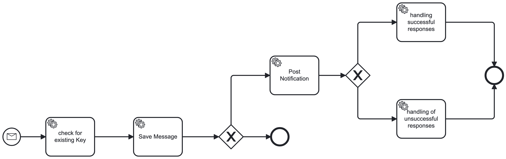

# Kafka Camunda Example
Camunda process that interacts with Kafka, Postgres Database

## Подготовка

Используем docker-compose для запуска:
1. Zookeper
2. Kafka-broker
3. WireMock 
4. Postgresql

Настройки - [application.yaml](src/main/resources/application.yaml) 

При запуске приложения: 

Создаются таблицы message, counter. Таблицы удалются, если существуют в бд [schema.sql](src/main/resources/schema.sql)

В таблицу counter помещается счетчик, который изначально равен 0 [data.sql](src/main/resources/.data.sql)

## Как работает?

Процесс начинается с [REST API Controller](src/main/java/ru/dmitry/springboot_camunda_kafka/controller/MessageController.java) - вызов происходит по адресу: "http://localhost:8080/kafka/send/message"
Далее контроллер отправляет сообщение вида (значение полей генерятся рандомно)

```
{
	"key": <random_key>,
	"payload": {
		"message_date": <YYYY-mm-ddThh24:MM:ss>,
		"message": <random_string>
	}
}
```

в топик Kafka **start-process-topic** 

Далее [Consumer](src/main/java/ru/dmitry/springboot_camunda_kafka/consumer/MessageConsumer.java) считывает сообщение из топика Kafka **start-process-topic**, запуская Camunda процесс

## BPMN Process


## Работа внутри Camunda процесса 
[check for existing Key](src/main/java/ru/dmitry/springboot_camunda_kafka/delegate/CheckEntityExistsDelegate.java) - проверяет есть ли сообщение в бд с таким key, которое пришло в новом сообщении. Если такой key уже есть в таблице - увеличивается счетик 

[Save Message](src/main/java/ru/dmitry/springboot_camunda_kafka/delegate/SaveMessageDelegate.java) - сохраняет полученное сообщение 

Далее процесс завершается, если counter <= 10. Если же counter >10, вызывается 

[Post Notification](src/main/java/ru/dmitry/springboot_camunda_kafka/delegate/PostNotificationDelegate.java) - выполняет POST запрос по адресу "http://localhost:8081/api/v1/notification". Данный сервис является mocked - его [mappings](src/main/resources/stubs). Оправляется сообщение вида

```
{
	"key": <from kafka topic>,
	"сount": <counter from db>
}
```

Затем происходит разветвление в зависимости от statusCode, полученный на предыдущем шаге: 
При получении statusCode==200 [handling successful responses](src/main/java/ru/dmitry/springboot_camunda_kafka/delegate/SuccessRequestsDelegate.java) - отправляет сообщение вида в топик Kafka **success-requests-topic**

```
{
	"key": <from kafka topic>,
	"status": 0
}
```

При получении statusCode!=200 [handling of unsuccessful responses](src/main/java/ru/dmitry/springboot_camunda_kafka/delegate/FailedRequestsDelegate.java) - отправляет сообщение вида в топик Kafka **failed-requests-topic**

```
{
	"key": <from kafka topic>,
	"status": -1
}
```
